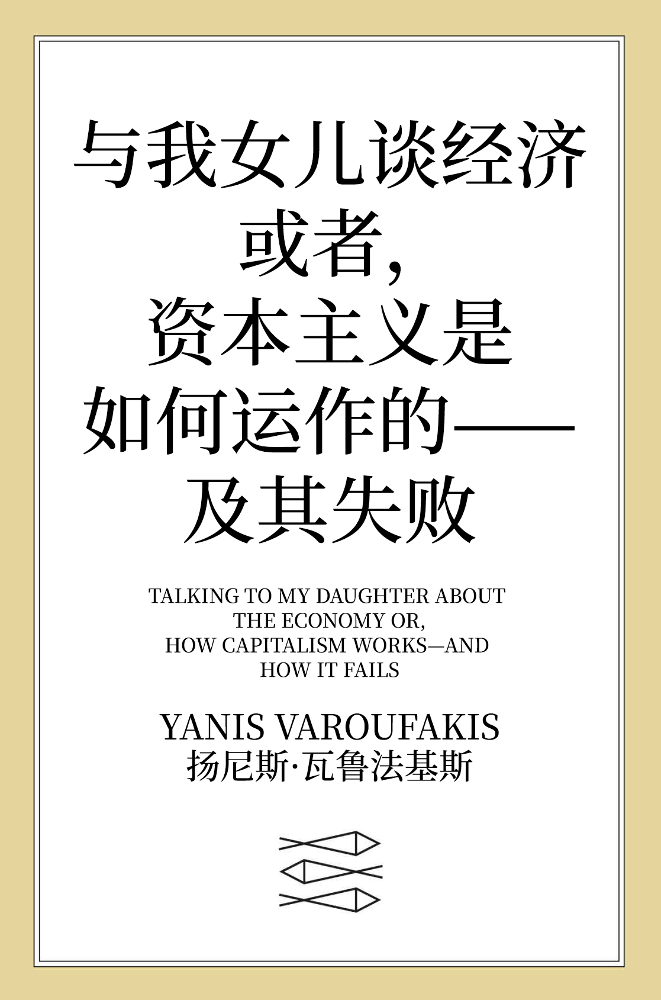

# 与我女儿谈经济

> 开始阅读：【[在线版](https://anartigone.github.io/ttmdate-web/)】【[下载版](https://github.com/anartigone/ttmdate-web/releases/)】

------

## 0x00 如何阅读

- 【PC/手机】用户均可从这个链接[直接阅读](https://anartigone.github.io/ttmdate-web/)
- 【手机】用户若加载时间过长，也可以阅读纯文字版：
   　（1）[注册](https://github.com/join?source=header-home) 一个 Github 账号
   　（2）点击此项目仓库([ttmdate-web](https://github.com/anartigone/ttmdate-web))右上角的 **Star** 和 **Fork** 按钮
   　（3）从 Google/App Store 搜索并安装 APP 【Github】 并登录
   　（4）在【仓库】中找到 [ttmdate-web](https://github.com/anartigone/ttmdate-web)，点击打开
   　（5）点击【浏览代码】可打开仓库文件，在路径 `gitbook/markdown/zh` 下即为各个章节的内容
- 希望热心的读者能积极参与纠错、反馈阅读中遇到的各种问题，电报群：[未竟共同体](https://t.me/+Ps3zrIsWwH1jMjE5)

## 0x10 内容预览

## 0x20 项目简介

这是《与我女儿谈经济：或者，资本主义是如何运作的——及其失败》 WEB 版的汉化项目，也是[re0-web](https://github.com/re-zero-khis/re0-web)的一个fork。目前每个章节的完整汉化流程包括：

1. 翻译（英 -> 中）
2. 润色（使得上下文表达语句意思更贴近中文环境）
3. 校对（专有名词修正、所有章节一致化）
4. 编排（文档格式）

这是一个知识开源计划的试水项目。翻译环节用的是[电子书翻译器 (ETCP)](https://github.com/bookfere/Ebook-Translator-Calibre-Plugin)的自定义引擎(Qwen2)+自定义词汇表，润色和校对环节**需要每个读者的参与和反馈** (欢迎提issue/开discussion讨论译法) 、优化排版和修复注释链接 (欢迎直接pr) 。

更多翻译详情请见[译者注释](https://anartigone.github.io/ttmdate-web/gitbook/markdown/translation.html#译者注释)

> 看中译本还不如直接看机翻的呢，高手都是读机翻的。
>
> ——张正午

为了提供高质量的机翻文本作为开源翻译的基底，本项目参考了拉黑字幕组译作中的用语习惯，制作出上千行的自定义词汇表以确保专业术语的翻译准确性，而非[沉浸式翻译](https://github.com/immersive-translate/immersive-translate)那种无脑机翻。在对比过谷歌翻译、DeepL和各种语言模型之后，最终选择用Qwen2翻译基础文本，再人工进行校对的方式生成了可读性较高的翻译结果。

> 两种模式的根本不同点在于他们对软件排错有着完全对立的认识。我从Linux的经验出发，证实了这样一个命题：“只要眼睛多，bug容易捉。”
>
> ——Eric S.Raymond 《大教堂与集市》

在未来，绝大多数商业公司/出版社所采用的“大教堂”模式将被开源世界采用的“集市”模式所取代。这个变革不应局限于软件行业，也应燎原于文化行业。让书友们像程序员给软件源代码排错那样，来校对自由开源的电子书吧！

## 0x30 相关资源

- 瓦鲁法基斯
	- Eye Of The Storm Podcast
	- DiEM25
	- 【中英双语字幕】 齐泽克 & 扬尼斯·瓦鲁法基斯 政治经济学&希腊-欧洲政治等  Festival INDIGO 2021
	- 【讲座】瓦鲁法基斯——资本主义的败北（2018）
	- 亚尼斯•瓦鲁法基斯对话乔姆斯基——美欧经济与未来（2016）
	- Europe is Kaput. Long live Europe! | Slavoj Žižek, Yanis Varoufakis and Julian Assange
- 蓝江
  -  【九月虺丛书42】技术封建主义
  -  从技术加速到云租金——如何思考当代技术封建主义思潮  
- [Re0：从零开始的异世界生活 （WEB 版）](https://github.com/re-zero-khis/re0-web)
- [电子书翻译器 (ETCP)](https://github.com/bookfere/Ebook-Translator-Calibre-Plugin)
- [翻译的现代性：译者任务、机械复制时代与文本星丛 S2EP24 - 例外状态 State of Exception](https://www.xiaoyuzhoufm.com/episode/63269c8da5d434d0ee90cc0d)
- [Vol 27 “翻译”作为一种女性主义实践 - 歧义 Disagreement](https://www.xiaoyuzhoufm.com/episode/6429a7301a5480d95859e6f8)

## 0x40 许可证和版权

代码基于GNU通用许可协议第三版发布：[GPLv3](https://www.gnu.org/licenses/gpl-3.0.html)

这是自由软件：你可以自由地修改和重新发布它。 在法律允许的范围内，**不提供任何保证**。

翻译内容遵循知识共享许可协议 (保持署名—非商用—相同方式共享)：[CC BY-NC-SA 4.0](http://creativecommons.org/licenses/by-nc-sa/4.0/)

允许修改和无通知转载，请附上本仓库链接及本声明，**禁止商用**。

## 0xF0 致开发者

此项目是利用 [Honkit](https://github.com/honkit/honkit) 搭建的，同时兼容在 [Github Pages](https://github.com/anartigone/ttmdate-web) 和 [本地（线下）](http://127.0.0.1:4000/) 运行。

> 关于 **本地** 环境的搭建可见 [honkit-docker-support](https://github.com/honkit/honkit#docker-support) 的说明

